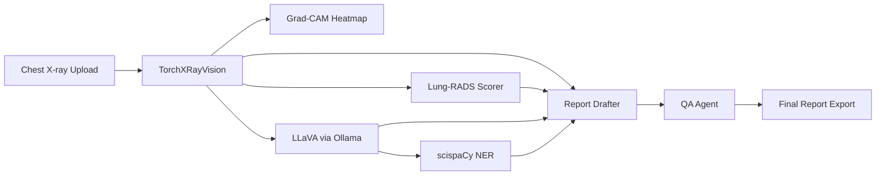

# 🫁 Radiology Report Copilot

> AI-powered frontal (PA/AP) chest X-ray analysis with Grad-CAM localization,
> a Lung-RADS-inspired risk category, and structured clinical report
> generation. Runs 100% locally — no data leaves your machine.

## What it does

Frontal (PA/AP) chest X-rays only. Upload an image and the app analyzes it in under two minutes: a vision model scores 18 pathologies, Grad-CAM highlights where the model is looking, LLaVA describes what it sees, a local LLM writes the impression, Lung-RADS-inspired scoring assigns a risk category (Lung-RADS is designed for CT; used here as a reference scale), and a rule-based QA check validates the output before you download a complete clinical document.

## Pipeline Architecture



| Stage | Module | Output |
|-------|--------|--------|
| 1. Vision | `app/vision/torchxray.py` | 18 pathology scores (top 5 shown in the UI) |
| 2. Localization | `app/vision/torchxray.py`, `app/vision/bbox.py` | Grad-CAM heatmap and anatomical bounding boxes |
| 3. Risk scoring | `app/pipeline/lung_rads.py` | Lung-RADS-inspired risk category (Lung-RADS is designed for CT; used here as a reference scale) |
| 4. Description | `app/vision/llava_client.py` | Clinical visual findings |
| 5. NER | `app/utils/ner.py` | Structured clinical entities |
| 6. Drafting | `app/pipeline/drafter.py` | FINDINGS / IMPRESSION / RECOMMENDATIONS |
| 7. QA | `app/pipeline/qa_agent.py` | Pass/fail validation |
| 8. Export | `app/pipeline/graph.py` | Timestamped clinical report |

Orchestration is handled by a LangGraph state machine in `app/pipeline/graph.py`. The Streamlit UI in `app/main.py` is the single entry point.

## Features

- **18 pathologies** detected via TorchXRayVision DenseNet121
- **Grad-CAM heatmaps** with a live multi-label switcher
- **Bounding-box localization** with a 3×3 anatomical region map (`app/vision/bbox.py`)
- **Lung-RADS-inspired risk category** (Lung-RADS is designed for CT; used here as a reference scale)
- **LLaVA visual description** via local Ollama
- **Structured report generation** with Llama 3.1 8B
- **Plain-English patient summary** via `generate_patient_summary()` in `app/pipeline/drafter.py`
- **Rule-based QA agent** — no hallucinated biopsy/MRI recommendations
- **CheXpert evaluation utilities** for benchmarking (`app/utils/evaluator.py`)
- **Full clinical report export** with pathology score bars and disclaimer

## Stack

| Component | Tool |
|-----------|------|
| Vision classification | TorchXRayVision (DenseNet121) |
| Explainability | pytorch-grad-cam, OpenCV |
| Vision-language model | LLaVA (Ollama) |
| Report drafting | Llama 3.1 8B (Ollama) |
| Pipeline orchestration | LangGraph |
| Clinical NER | scispaCy `en_core_sci_sm` |
| Risk scoring | Lung-RADS-inspired reference scale (designed for CT) |
| Web UI | Streamlit |
| Testing | pytest |

## Prerequisites

- Python 3.10+
- [Ollama](https://ollama.com/download) installed and running
- ~8 GB disk for models (TorchXRayVision weights + Ollama models)
- 16 GB RAM recommended

Pull required Ollama models:

```bash
ollama pull llava
ollama pull llama3.1:8b
```

## Installation

```bash
git clone https://github.com/SathvikReddySirigiri/radiology-copilot.git
cd radiology-copilot

python -m venv venv
source venv/bin/activate        # Windows: venv\Scripts\activate

pip install -r requirements.txt

# scispaCy clinical model (not on PyPI)
pip install https://s3-us-west-2.amazonaws.com/ai2-s2-scispacy/releases/v0.5.3/en_core_sci_sm-0.5.3.tar.gz

cp .env.example .env
```

### Windows notes

```powershell
$env:PYTHONIOENCODING = "utf-8"
python -m streamlit run app/main.py
```

TorchXRayVision downloads model weights (~28 MB) on first run to `~/.torchxrayvision/`.

## Usage

```bash
python -m streamlit run app/main.py
```

1. Open `http://localhost:8501`
2. Upload a frontal (PA/AP) chest X-ray (PNG or JPG)
3. Click **Run Analysis** (~90 seconds first run)
4. Review pathology scores, Grad-CAM heatmap, bounding boxes, Lung-RADS category, and final report
5. Download the full clinical report as a timestamped `.txt` file

### Run tests

```bash
pytest tests/
python -m app.pipeline.lung_rads      # Lung-RADS scenario tests
python -m app.utils.evaluator         # CheXpert metrics tests
python -m app.vision.torchxray        # Grad-CAM smoke test
```

## Project Structure

```
radiology-copilot/
├── app/
│   ├── main.py                 # Streamlit UI
│   ├── vision/
│   │   ├── torchxray.py        # Pathology scores + Grad-CAM
│   │   ├── llava_client.py     # LLaVA via Ollama
│   │   └── bbox.py             # Bounding boxes + anatomical labels
│   ├── pipeline/
│   │   ├── graph.py            # LangGraph orchestration
│   │   ├── drafter.py          # Report + patient summary
│   │   ├── qa_agent.py         # Rule-based validation
│   │   └── lung_rads.py        # Lung-RADS 1.1 scorer
│   └── utils/
│       ├── ner.py              # scispaCy entity extraction
│       └── evaluator.py        # CheXpert benchmark metrics
├── data/samples/               # Place test X-rays here (gitignored)
├── scripts/
│   └── generate_summary_docx.py
├── tests/
│   ├── test_pipeline.py
│   ├── test_qa.py
│   └── test_vision.py
├── .env.example
├── .gitignore
├── requirements.txt
├── Radiology_Report_Copilot_Summary.docx
└── README.md
```

## Environment Variables

| Variable | Default | Description |
|----------|---------|-------------|
| `OLLAMA_BASE_URL` | `http://localhost:11434` | Ollama API endpoint |
| `MODEL_VISION` | `llava` | Vision model name |
| `MODEL_LLM` | `llama3.1:8b` | Report drafting model |
| `DEBUG` | `true` | Debug logging flag |

## Disclaimer

This tool is for **research and educational purposes only**. It is not FDA-cleared, not a medical device, and must not be used for clinical diagnosis or treatment decisions. All AI-generated findings require verification by a licensed radiologist.

## License

MIT
